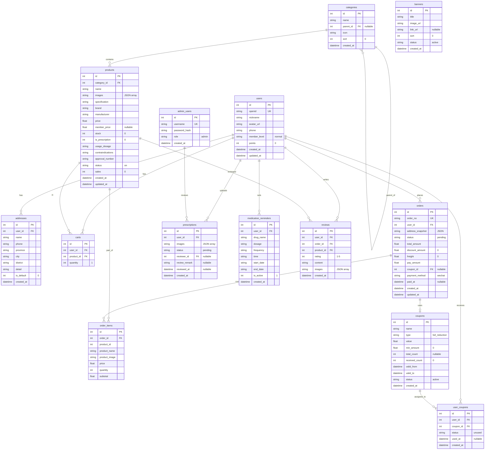
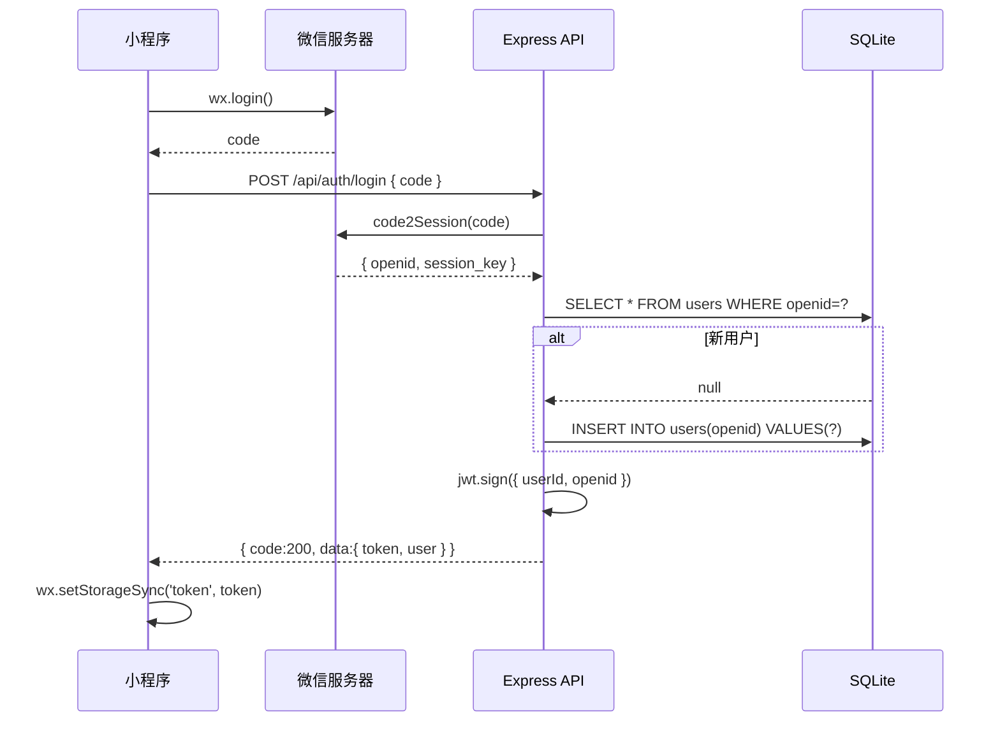
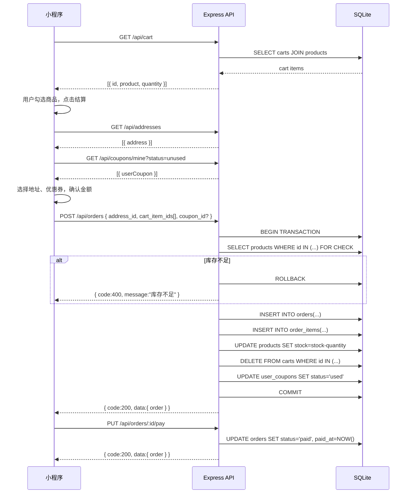
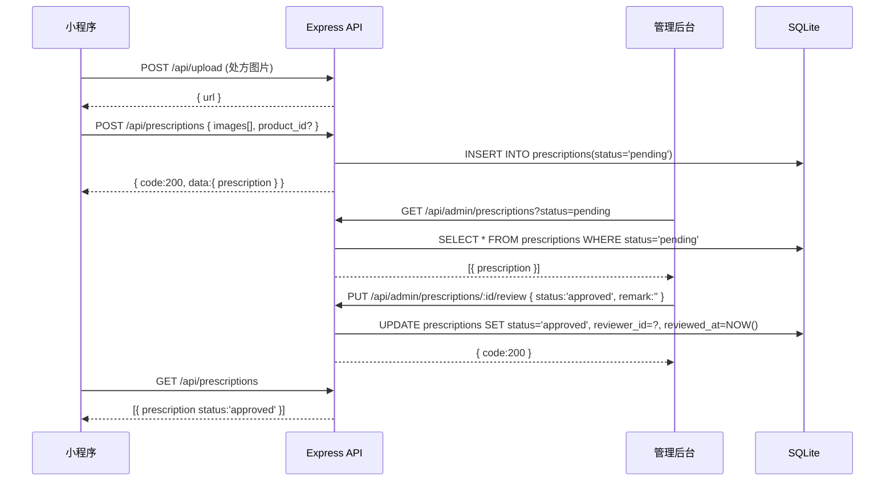
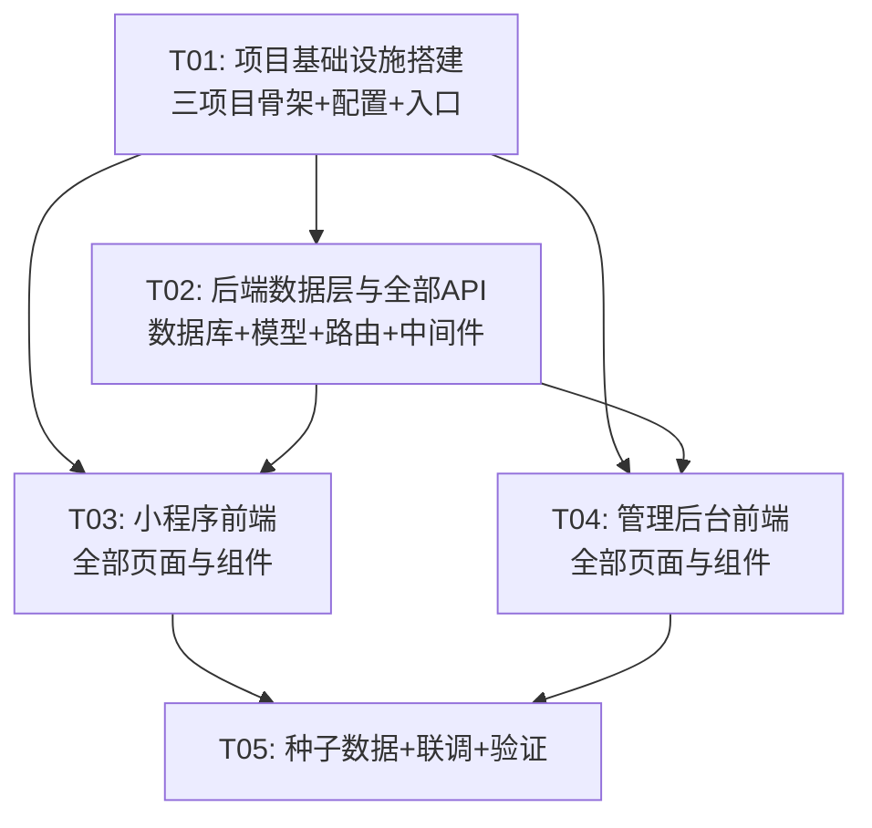

# 药店网上商城小程序 — 系统架构设计文档

> **Architect**: Bob (软件架构师)
> **版本**: v1.0
> **日期**: 2025-07-09

---

## Part A: 系统设计

### 1. 实现方案概述

#### 1.1 整体架构

采用 **前后端分离** 架构，三个独立子项目：

| 子项目 | 目录 | 技术栈 | 说明 |
|--------|------|--------|------|
| 后端 API | `backend/` | Node.js + Express + SQLite | RESTful API，为小程序与管理后台统一提供服务 |
| 微信小程序 | `miniprogram/` | 微信原生框架 | C 端用户购药入口 |
| 管理后台 | `admin/` | Vite + React + MUI + Tailwind CSS | Web 端运营管理 |

```
┌─────────────┐     ┌──────────────┐     ┌─────────────────┐
│  微信小程序   │────▶│              │◀────│  管理后台(Web)   │
│  (Native)    │     │  Express API │     │  (React + MUI)  │
└─────────────┘     │  :3000       │     └─────────────────┘
                    │  SQLite      │
                    └──────────────┘
```

#### 1.2 核心技术挑战与选型

| 挑战 | 解决方案 |
|------|----------|
| 微信登录与用户标识 | `jsonwebtoken` 签发 JWT，openid 作为用户唯一标识 |
| 文件上传（处方/商品图） | `multer` 中间件，存储至本地 `uploads/` 目录，通过静态资源路由访问 |
| 处方药审核流程 | 处方表 `prescriptions` 记录审核状态机（pending→approved/rejected） |
| 订单快照 | 下单时序列化地址、商品信息存入 `address_snapshot` 和 `OrderItem`，避免后续变更影响历史订单 |
| 管理后台认证 | 独立 AdminUser 表 + JWT 登录，与小程序用户体系隔离 |
| SQLite 并发限制 | 使用 `better-sqlite3`（同步 API，WAL 模式），MVP 阶段完全满足需求 |

#### 1.3 后端中间件栈

```
Express App
  ├── cors()                    # 跨域
  ├── express.json()            # JSON Body 解析
  ├── express.urlencoded()      # Form Body 解析
  ├── express.static('uploads') # 静态资源
  ├── [auth middleware]         # JWT 鉴权（按路由应用）
  ├── [upload middleware]       # multer 文件上传（按路由应用）
  └── [errorHandler]            # 全局错误处理
```

---

### 2. 项目文件结构

```
pharmacy-mall/
│
├── docs/
│   ├── system_design.md            # 本文档
│   ├── class-diagram.mermaid       # 数据模型类图（提取）
│   └── sequence-diagram.mermaid    # 核心流程时序图（提取）
│
├── backend/
│   ├── package.json
│   ├── .env                        # 环境变量（JWT_SECRET, PORT等）
│   ├── .env.example
│   ├── src/
│   │   ├── app.js                  # Express 应用配置（中间件、路由挂载）
│   │   ├── server.js               # 启动入口（监听端口）
│   │   ├── config/
│   │   │   └── index.js            # 配置读取（环境变量 + 默认值）
│   │   ├── db/
│   │   │   ├── index.js            # 数据库连接（better-sqlite3 初始化）
│   │   │   ├── schema.sql          # DDL：全部建表语句
│   │   │   └── seed.js             # 种子数据：分类、药品、优惠券、管理员
│   │   ├── middleware/
│   │   │   ├── auth.js             # JWT 鉴权中间件（user + admin 双模式）
│   │   │   ├── upload.js           # multer 配置（按类型分目录存储）
│   │   │   └── errorHandler.js     # 全局错误处理器
│   │   ├── routes/
│   │   │   ├── index.js            # 路由汇总 + /api 前缀挂载
│   │   │   ├── auth.js             # POST /auth/login, GET /auth/profile
│   │   │   ├── categories.js       # GET /categories
│   │   │   ├── products.js         # GET /products, GET /products/:id, GET /products/search
│   │   │   ├── cart.js             # CRUD /cart
│   │   │   ├── orders.js           # POST /orders, GET /orders, GET /orders/:id
│   │   │   ├── addresses.js        # CRUD /addresses
│   │   │   ├── prescriptions.js    # CRUD /prescriptions
│   │   │   ├── coupons.js          # GET /coupons, GET /coupons/mine
│   │   │   ├── reviews.js          # GET /products/:id/reviews, POST /reviews
│   │   │   ├── reminders.js        # CRUD /reminders
│   │   │   ├── upload.js           # POST /upload（图片上传）
│   │   │   └── admin/
│   │   │       ├── index.js        # /api/admin 前缀 + auth/admin 鉴权
│   │   │       ├── auth.js         # POST /admin/login
│   │   │       ├── dashboard.js    # GET /admin/dashboard
│   │   │       ├── products.js     # CRUD /admin/products
│   │   │       ├── orders.js       # GET/PUT /admin/orders
│   │   │       ├── prescriptions.js# GET/PUT /admin/prescriptions
│   │   │       ├── users.js        # GET /admin/users
│   │   │       ├── coupons.js      # CRUD /admin/coupons
│   │   │       └── banners.js      # CRUD /admin/banners
│   │   ├── models/
│   │   │   ├── user.js             # 用户数据访问
│   │   │   ├── product.js          # 商品数据访问
│   │   │   ├── category.js         # 分类数据访问
│   │   │   ├── cart.js             # 购物车数据访问
│   │   │   ├── order.js            # 订单数据访问
│   │   │   ├── address.js          # 地址数据访问
│   │   │   ├── prescription.js     # 处方数据访问
│   │   │   ├── coupon.js           # 优惠券数据访问
│   │   │   ├── reminder.js         # 用药提醒数据访问
│   │   │   └── review.js           # 评价数据访问
│   │   └── utils/
│   │       ├── response.js         # 统一响应格式 { code, data, message }
│   │       └── helpers.js          # 工具函数（订单号生成等）
│   └── uploads/                    # 文件存储根目录（运行时创建）
│       ├── products/
│       ├── prescriptions/
│       └── banners/
│
├── miniprogram/
│   ├── app.js                      # 小程序入口（全局数据、登录状态）
│   ├── app.json                    # 全局配置（页面路由、tabBar、窗口样式）
│   ├── app.wxss                    # 全局样式
│   ├── project.config.json         # 项目配置（appid 占位）
│   ├── sitemap.json                # 搜索配置
│   ├── utils/
│   │   ├── api.js                  # 网络请求封装（wx.request + JWT + 错误处理）
│   │   ├── auth.js                 # 登录逻辑（wx.login → 后端换取 token）
│   │   └── util.js                 # 通用工具（日期格式化、价格展示等）
│   ├── pages/
│   │   ├── index/                  # 首页：搜索栏 + Banner + 分类入口 + 推荐商品
│   │   │   ├── index.js
│   │   │   ├── index.json
│   │   │   ├── index.wxml
│   │   │   └── index.wxss
│   │   ├── category/               # 分类页：左一级类目 + 右二级商品列表
│   │   │   ├── index.js
│   │   │   ├── index.json
│   │   │   ├── index.wxml
│   │   │   └── index.wxss
│   │   ├── cart/                   # 购物车：列表 + 全选 + 合计 + 结算
│   │   │   ├── index.js
│   │   │   ├── index.json
│   │   │   ├── index.wxml
│   │   │   └── index.wxss
│   │   ├── mine/                   # 个人中心：订单入口 + 处方 + 地址 + 优惠券 + 积分
│   │   │   ├── index.js
│   │   │   ├── index.json
│   │   │   ├── index.wxml
│   │   │   └── index.wxss
│   │   ├── product-detail/         # 商品详情：轮播图 + 规格价格 + 用法禁忌 + 加购
│   │   │   ├── index.js
│   │   │   ├── index.json
│   │   │   ├── index.wxml
│   │   │   └── index.wxss
│   │   ├── search/                 # 搜索：搜索框 + 历史 + 热搜 + 结果列表
│   │   │   ├── index.js
│   │   │   ├── index.json
│   │   │   ├── index.wxml
│   │   │   └── index.wxss
│   │   ├── checkout/               # 订单确认：地址 + 商品清单 + 优惠券 + 金额 + 支付
│   │   │   ├── index.js
│   │   │   ├── index.json
│   │   │   ├── index.wxml
│   │   │   └── index.wxss
│   │   ├── order-list/             # 订单列表：tab 切换状态 + 操作按钮
│   │   │   ├── index.js
│   │   │   ├── index.json
│   │   │   ├── index.wxml
│   │   │   └── index.wxss
│   │   ├── order-detail/           # 订单详情：物流状态 + 商品 + 金额 + 操作
│   │   │   ├── index.js
│   │   │   ├── index.json
│   │   │   ├── index.wxml
│   │   │   └── index.wxss
│   │   ├── address-list/           # 地址列表
│   │   │   ├── index.js
│   │   │   ├── index.json
│   │   │   ├── index.wxml
│   │   │   └── index.wxss
│   │   ├── address-edit/           # 地址编辑：新增/修改
│   │   │   ├── index.js
│   │   │   ├── index.json
│   │   │   ├── index.wxml
│   │   │   └── index.wxss
│   │   ├── prescription/           # 处方：上传 + 列表 + 审核状态
│   │   │   ├── index.js
│   │   │   ├── index.json
│   │   │   ├── index.wxml
│   │   │   └── index.wxss
│   │   ├── coupons/                # 优惠券中心
│   │   │   ├── index.js
│   │   │   ├── index.json
│   │   │   ├── index.wxml
│   │   │   └── index.wxss
│   │   └── reminder/               # 用药提醒：列表 + 新增/编辑弹窗
│   │       ├── index.js
│   │       ├── index.json
│   │       ├── index.wxml
│   │       └── index.wxss
│   └── components/
│       ├── product-card/           # 商品卡片组件（图片+名称+价格+加购按钮）
│       │   ├── index.js
│       │   ├── index.json
│       │   ├── index.wxml
│       │   └── index.wxss
│       └── cart-item/              # 购物车条目组件（勾选+图片+名称+数量+价格）
│           ├── index.js
│           ├── index.json
│           ├── index.wxml
│           └── index.wxss
│
└── admin/
    ├── package.json
    ├── vite.config.js              # Vite 配置（代理 /api → backend:3000）
    ├── tailwind.config.js          # Tailwind 配置
    ├── postcss.config.js           # PostCSS 配置
    ├── index.html                  # SPA 入口 HTML
    ├── src/
    │   ├── main.jsx                # React 入口（StrictMode + Router + Theme）
    │   ├── App.jsx                 # 路由根组件（登录/布局/页面路由）
    │   ├── index.css               # Tailwind 指令 + 全局样式
    │   ├── api/
    │   │   └── index.js            # Axios 实例（baseURL, JWT 拦截器）+ 全量 API 函数
    │   ├── context/
    │   │   └── AuthContext.jsx      # 认证上下文（login/logout/token 管理）
    │   ├── components/
    │   │   ├── AdminLayout.jsx      # 管理后台布局（侧边栏 + 顶栏 + 内容区）
    │   │   ├── Sidebar.jsx          # 侧边导航菜单
    │   │   └── ProtectedRoute.jsx   # 路由守卫（未登录重定向）
    │   └── pages/
    │       ├── Login.jsx            # 登录页
    │       ├── Dashboard.jsx        # 仪表盘（概览卡片 + 图表）
    │       ├── ProductList.jsx      # 商品列表（表格 + 搜索 + 上下架）
    │       ├── ProductEdit.jsx      # 商品编辑（新增/修改表单）
    │       ├── OrderList.jsx        # 订单列表（筛选 + 状态流转）
    │       ├── OrderDetail.jsx      # 订单详情
    │       ├── PrescriptionList.jsx # 处方审核列表
    │       ├── PrescriptionReview.jsx# 处方审核详情（通过/驳回）
    │       ├── UserList.jsx         # 用户列表
    │       ├── CouponList.jsx       # 优惠券管理
    │       ├── CouponEdit.jsx       # 优惠券编辑
    │       ├── BannerList.jsx       # Banner 管理
    │       └── BannerEdit.jsx       # Banner 编辑
    └── public/                     # 静态资源（空，favicon 等）
```

---

### 3. 数据模型设计

#### 3.1 数据库表结构（Mermaid ER 图）



---

### 4. API 接口清单

#### 4.1 小程序端 API（需 User JWT）

| 方法 | 路径 | 说明 | 请求体 / Query | 响应 |
|------|------|------|---------------|------|
| POST | `/api/auth/login` | 微信登录 | `{ code, nickname?, avatar_url? }` | `{ token, user }` |
| GET | `/api/auth/profile` | 获取个人信息 | — | `{ ...user }` |
| PUT | `/api/auth/profile` | 更新个人信息 | `{ nickname, avatar_url, phone }` | `{ ...user }` |
| GET | `/api/categories` | 全部分类（树形） | — | `[{ id, name, children }]` |
| GET | `/api/products` | 商品列表 | `?category_id=&page=&page_size=&sort=` | `{ list, total }` |
| GET | `/api/products/search` | 搜索商品 | `?q=&page=&page_size=` | `{ list, total }` |
| GET | `/api/products/:id` | 商品详情 | — | `{ ...product, reviews[] }` |
| GET | `/api/cart` | 购物车列表 | — | `[{ id, product, quantity }]` |
| POST | `/api/cart` | 加入购物车 | `{ product_id, quantity }` | `{ ...cartItem }` |
| PUT | `/api/cart/:id` | 修改数量 | `{ quantity }` | `{ ...cartItem }` |
| DELETE | `/api/cart/:id` | 删除商品 | — | `{ message }` |
| DELETE | `/api/cart` | 清空购物车 | — | `{ message }` |
| GET | `/api/addresses` | 地址列表 | — | `[{ ...address }]` |
| POST | `/api/addresses` | 新增地址 | `{ name, phone, province, city, district, detail, is_default }` | `{ ...address }` |
| PUT | `/api/addresses/:id` | 编辑地址 | 同上 | `{ ...address }` |
| DELETE | `/api/addresses/:id` | 删除地址 | — | `{ message }` |
| PUT | `/api/addresses/:id/default` | 设为默认 | — | `{ ...address }` |
| POST | `/api/orders` | 创建订单 | `{ address_id, cart_item_ids[], coupon_id?, remark? }` | `{ order }` |
| GET | `/api/orders` | 订单列表 | `?status=&page=&page_size=` | `{ list, total }` |
| GET | `/api/orders/:id` | 订单详情 | — | `{ order, items[] }` |
| PUT | `/api/orders/:id/pay` | 模拟支付 | — | `{ order }` |
| PUT | `/api/orders/:id/cancel` | 取消订单 | — | `{ order }` |
| POST | `/api/orders/:id/confirm` | 确认收货 | — | `{ order }` |
| GET | `/api/prescriptions` | 处方列表 | — | `[{ ...prescription }]` |
| POST | `/api/prescriptions` | 上传处方 | `{ images[], product_id? }` | `{ ...prescription }` |
| GET | `/api/coupons` | 可领优惠券 | — | `[{ ...coupon }]` |
| GET | `/api/coupons/mine` | 我的优惠券 | `?status=` | `[{ ...userCoupon }]` |
| POST | `/api/coupons/:id/receive` | 领取优惠券 | — | `{ ...userCoupon }` |
| GET | `/api/products/:id/reviews` | 商品评价 | `?page=&page_size=` | `{ list, total }` |
| POST | `/api/reviews` | 发表评价 | `{ order_id, product_id, rating, content, images[] }` | `{ ...review }` |
| GET | `/api/reminders` | 提醒列表 | — | `[{ ...reminder }]` |
| POST | `/api/reminders` | 创建提醒 | `{ drug_name, dosage, frequency, time, start_date, end_date }` | `{ ...reminder }` |
| PUT | `/api/reminders/:id` | 编辑提醒 | 同上 | `{ ...reminder }` |
| DELETE | `/api/reminders/:id` | 删除提醒 | — | `{ message }` |
| POST | `/api/upload` | 上传图片 | FormData `file` | `{ url }` |

#### 4.2 管理后台 API（需 Admin JWT）

| 方法 | 路径 | 说明 |
|------|------|------|
| POST | `/api/admin/login` | 管理员登录 `{ username, password }` → `{ token }` |
| GET | `/api/admin/dashboard` | 仪表盘数据（今日订单数、销售额、新增用户等） |
| GET | `/api/admin/products` | 商品列表（含分页、搜索、筛选） |
| POST | `/api/admin/products` | 新增商品 |
| PUT | `/api/admin/products/:id` | 编辑商品 |
| PUT | `/api/admin/products/:id/status` | 上下架 `{ status }` |
| DELETE | `/api/admin/products/:id` | 删除商品 |
| GET | `/api/admin/orders` | 订单列表（含筛选） |
| GET | `/api/admin/orders/:id` | 订单详情 |
| PUT | `/api/admin/orders/:id/ship` | 发货 `{ tracking_no?, logistics_company? }` |
| GET | `/api/admin/prescriptions` | 处方审核列表 |
| GET | `/api/admin/prescriptions/:id` | 处方详情 |
| PUT | `/api/admin/prescriptions/:id/review` | 审核处方 `{ status, remark }` |
| GET | `/api/admin/users` | 用户列表 |
| CRUD | `/api/admin/coupons` | 优惠券管理 |
| CRUD | `/api/admin/banners` | Banner 管理 |

---

### 5. 程序调用流程（核心时序图）

#### 5.1 用户登录流程



#### 5.2 下单支付流程



#### 5.3 处方上传与审核流程



---

### 6. 待明确事项

| 编号 | 问题 | 当前假设 |
|------|------|----------|
| Q1 | 微信小程序 AppID 是否已注册？ | 假设已有测试号，`project.config.json` 中占位 |
| Q2 | 微信支付是否需要真实对接？ | PRD 明确"模拟支付"，`PUT /orders/:id/pay` 直接改状态 |
| Q3 | 处方药购买是否强制关联已审核处方？ | 当前设计：处方上传独立，下单时不强制校验；后续可加拦截 |
| Q4 | 会员等级与积分规则？ | 当前 MVP 不做自动升降级，积分仅展示；后续 P1 迭代 |
| Q5 | 管理后台部署在同一服务器？ | 是，`vite.config.js` 中配置 dev proxy → `localhost:3000` |
| Q6 | 是否需要短信/模板消息通知？ | MVP 不做，P1 可加微信订阅消息 |

---

## Part B: 任务分解

### 7. 所需依赖包

#### backend/package.json
```json
{
  "dependencies": {
    "express": "^4.18.2",
    "better-sqlite3": "^9.4.3",
    "jsonwebtoken": "^9.0.2",
    "bcryptjs": "^2.4.3",
    "multer": "^1.4.5-lts.1",
    "cors": "^2.8.5",
    "uuid": "^9.0.0",
    "express-validator": "^7.0.1",
    "dotenv": "^16.3.1"
  },
  "devDependencies": {
    "nodemon": "^3.0.2"
  }
}
```

#### admin/package.json
```json
{
  "dependencies": {
    "react": "^18.2.0",
    "react-dom": "^18.2.0",
    "react-router-dom": "^6.20.0",
    "@mui/material": "^5.14.20",
    "@mui/icons-material": "^5.14.19",
    "@emotion/react": "^11.11.1",
    "@emotion/styled": "^11.11.0",
    "axios": "^1.6.2",
    "recharts": "^2.10.3",
    "dayjs": "^1.11.10"
  },
  "devDependencies": {
    "@vitejs/plugin-react": "^4.2.1",
    "vite": "^5.0.8",
    "tailwindcss": "^3.4.0",
    "postcss": "^8.4.32",
    "autoprefixer": "^10.4.16"
  }
}
```

---

### 8. 任务列表（按依赖排序）

#### T01 — 项目基础设施搭建

| 属性 | 内容 |
|------|------|
| **任务ID** | T01 |
| **任务名称** | 项目基础设施搭建（三项目骨架 + 配置 + 入口） |
| **优先级** | P0 |
| **依赖** | 无 |
| **源文件** | |

**backend/**
- `backend/package.json` — 依赖声明与脚本（dev/start）
- `backend/.env` — 环境变量（PORT=3000, JWT_SECRET, DB_PATH）
- `backend/.env.example` — 环境变量模板
- `backend/src/config/index.js` — 配置读取模块
- `backend/src/app.js` — Express 应用（中间件注册 + 路由挂载）
- `backend/src/server.js` — 启动入口（监听端口）
- `backend/src/utils/response.js` — 统一响应格式 `{ code, data, message }`
- `backend/src/utils/helpers.js` — 工具函数（订单号生成 UUID）
- `backend/src/middleware/errorHandler.js` — 全局错误处理器

**miniprogram/**
- `miniprogram/app.js` — 小程序入口（全局数据 + 登录态初始化）
- `miniprogram/app.json` — 全局配置（pages 路由 + tabBar[首页/分类/购物车/我的] + window）
- `miniprogram/app.wxss` — 全局样式（CSS 变量：主题色、字号、间距）
- `miniprogram/project.config.json` — 项目配置
- `miniprogram/sitemap.json` — 搜索配置

**admin/**
- `admin/package.json` — 依赖声明与脚本
- `admin/vite.config.js` — Vite 配置（React 插件 + API 代理到 :3000）
- `admin/tailwind.config.js` — Tailwind 配置（content 路径）
- `admin/postcss.config.js` — PostCSS 配置
- `admin/index.html` — SPA 入口 HTML
- `admin/src/main.jsx` — React 入口（StrictMode + BrowserRouter）
- `admin/src/App.jsx` — 路由根组件（Routes：Login, AdminLayout 下子路由）
- `admin/src/index.css` — Tailwind 指令 + MUI 主题覆盖

#### T02 — 后端数据层与全部 API

| 属性 | 内容 |
|------|------|
| **任务ID** | T02 |
| **任务名称** | 后端数据层与全部 API（数据库 + 模型 + 路由 + 中间件） |
| **优先级** | P0 |
| **依赖** | T01 |
| **源文件** | |

- `backend/src/db/schema.sql` — DDL（全部 14 张表）
- `backend/src/db/index.js` — better-sqlite3 连接初始化 + WAL 模式 + 执行 schema
- `backend/src/db/seed.js` — 种子数据（管理员、分类、20+ 药品、优惠券、Banner）
- `backend/src/middleware/auth.js` — JWT 鉴权（user 模式 + admin 模式，双导出）
- `backend/src/middleware/upload.js` — multer 配置（按类型分 products/prescriptions/banners 目录）
- `backend/src/models/user.js` — 用户数据访问（findByOpenid, create, findById, update）
- `backend/src/models/product.js` — 商品数据访问（list, search, findById, create, update, updateStatus）
- `backend/src/models/category.js` — 分类数据访问（getTree, findById）
- `backend/src/models/cart.js` — 购物车数据访问（listByUser, add, updateQty, remove, clearByUser）
- `backend/src/models/order.js` — 订单数据访问（create, listByUser, findById, updateStatus）
- `backend/src/models/address.js` — 地址数据访问（CRUD + setDefault）
- `backend/src/models/prescription.js` — 处方数据访问（CRUD + review）
- `backend/src/models/coupon.js` — 优惠券数据访问（listAvailable, listByUser, receive）
- `backend/src/models/reminder.js` — 提醒数据访问（CRUD）
- `backend/src/models/review.js` — 评价数据访问（listByProduct, create）
- `backend/src/routes/index.js` — 路由汇总（挂载所有子路由到 `/api`）
- `backend/src/routes/auth.js` — `POST /login`, `GET /profile`, `PUT /profile`
- `backend/src/routes/categories.js` — `GET /categories`
- `backend/src/routes/products.js` — `GET /products`, `GET /products/search`, `GET /products/:id`
- `backend/src/routes/cart.js` — CRUD `/cart`
- `backend/src/routes/orders.js` — `POST /orders`, `GET /orders`, `GET /orders/:id`, `PUT pay/cancel/confirm`
- `backend/src/routes/addresses.js` — CRUD `/addresses` + setDefault
- `backend/src/routes/prescriptions.js` — `GET/POST /prescriptions`
- `backend/src/routes/coupons.js` — `GET /coupons`, `GET /coupons/mine`, `POST receive`
- `backend/src/routes/reviews.js` — `GET /products/:id/reviews`, `POST /reviews`
- `backend/src/routes/reminders.js` — CRUD `/reminders`
- `backend/src/routes/upload.js` — `POST /upload`（multer 单文件上传）
- `backend/src/routes/admin/index.js` — `/api/admin` 前缀 + authAdmin 中间件 + 挂载子路由
- `backend/src/routes/admin/auth.js` — `POST /admin/login`
- `backend/src/routes/admin/dashboard.js` — `GET /admin/dashboard`
- `backend/src/routes/admin/products.js` — CRUD `/admin/products` + 上下架
- `backend/src/routes/admin/orders.js` — `GET /admin/orders`, `GET /:id`, `PUT ship`
- `backend/src/routes/admin/prescriptions.js` — `GET /admin/prescriptions`, `PUT review`
- `backend/src/routes/admin/users.js` — `GET /admin/users`
- `backend/src/routes/admin/coupons.js` — CRUD `/admin/coupons`
- `backend/src/routes/admin/banners.js` — CRUD `/admin/banners`

#### T03 — 小程序前端全部页面与组件

| 属性 | 内容 |
|------|------|
| **任务ID** | T03 |
| **任务名称** | 小程序前端全部页面与组件 |
| **优先级** | P0 |
| **依赖** | T02（需后端 API 就绪后联调） |
| **源文件** | |

- `miniprogram/utils/api.js` — `wx.request` 封装（自动拼接 baseURL、携带 JWT、统一错误处理）
- `miniprogram/utils/auth.js` — 登录逻辑（wx.login → 后端换取 token → 存储 → 全局状态）
- `miniprogram/utils/util.js` — 工具函数（日期格式化、价格 `¥xx.xx`、防抖）
- `miniprogram/pages/index/index.{js,json,wxml,wxss}` — 首页（搜索栏 + Banner swiper + 分类网格 + 推荐商品列表）
- `miniprogram/pages/category/index.{js,json,wxml,wxss}` — 分类页（左侧一级 scroll-view + 右侧二级商品 grid）
- `miniprogram/pages/cart/index.{js,json,wxml,wxss}` — 购物车（列表 + 全选/反选 + 数量调整 + 合计 + 结算按钮）
- `miniprogram/pages/mine/index.{js,json,wxml,wxss}` — 个人中心（头像昵称 + 订单入口 5 状态 tab + 处方/地址/优惠券/积分/提醒入口）
- `miniprogram/pages/product-detail/index.{js,json,wxml,wxss}` — 商品详情（轮播图 + 金额 + 规格 + 用法禁忌 + 底部加购/立即购买）
- `miniprogram/pages/search/index.{js,json,wxml,wxss}` — 搜索（输入框 + 历史标签 + 热搜词 + 搜索结果列表）
- `miniprogram/pages/checkout/index.{js,json,wxml,wxss}` — 订单确认（地址卡片 + 商品清单 + 优惠券选择 + 金额明细 + 提交按钮）
- `miniprogram/pages/order-list/index.{js,json,wxml,wxss}` — 订单列表（顶部 tab 切换状态 + 订单卡片 + 操作按钮）
- `miniprogram/pages/order-detail/index.{js,json,wxml,wxss}` — 订单详情（状态进度 + 地址 + 商品 + 金额 + 底部操作栏）
- `miniprogram/pages/address-list/index.{js,json,wxml,wxss}` — 地址列表（卡片 + 默认标记 + 新增入口）
- `miniprogram/pages/address-edit/index.{js,json,wxml,wxss}` — 地址编辑（省市区选择器 + 表单 + 保存）
- `miniprogram/pages/prescription/index.{js,json,wxml,wxss}` — 处方（上传图片 + 列表 + 审核状态标签）
- `miniprogram/pages/coupons/index.{js,json,wxml,wxss}` — 优惠券（可领列表 + 已领 tab）
- `miniprogram/pages/reminder/index.{js,json,wxml,wxss}` — 用药提醒（列表 + 新增/编辑表单弹窗）
- `miniprogram/components/product-card/index.{js,json,wxml,wxss}` — 商品卡片组件
- `miniprogram/components/cart-item/index.{js,json,wxml,wxss}` — 购物车条目组件

#### T04 — 管理后台前端全部页面

| 属性 | 内容 |
|------|------|
| **任务ID** | T04 |
| **任务名称** | 管理后台前端全部页面与组件 |
| **优先级** | P0 |
| **依赖** | T02（需后端 API 就绪后联调） |
| **源文件** | |

- `admin/src/api/index.js` — Axios 实例 + 请求/响应拦截器 + 全量 API 函数封装
- `admin/src/context/AuthContext.jsx` — 认证上下文（Provider + useAuth hook）
- `admin/src/components/AdminLayout.jsx` — 布局（Sidebar + AppBar + Outlet 内容区）
- `admin/src/components/Sidebar.jsx` — 侧边导航（MUI Drawer + List + 路由跳转）
- `admin/src/components/ProtectedRoute.jsx` — 路由守卫（无 token → 重定向 /login）
- `admin/src/pages/Login.jsx` — 登录页（用户名/密码 + MUI Card + 登录按钮）
- `admin/src/pages/Dashboard.jsx` — 仪表盘（4 统计卡片 + 近 7 日销售趋势折线图 + 最近订单列表）
- `admin/src/pages/ProductList.jsx` — 商品列表（MUI Table + 搜索框 + 分页 + 上下架开关 + 新增/编辑按钮）
- `admin/src/pages/ProductEdit.jsx` — 商品编辑（表单：基本信息 + 图片上传 + 价格库存 + 用法禁忌 + 处方药开关）
- `admin/src/pages/OrderList.jsx` — 订单列表（Table + 状态筛选 + 发货操作）
- `admin/src/pages/OrderDetail.jsx` — 订单详情（信息展示 + 发货表单弹窗 + 状态流转按钮）
- `admin/src/pages/PrescriptionList.jsx` — 处方审核列表（Table + 状态筛选）
- `admin/src/pages/PrescriptionReview.jsx` — 处方审核（图片预览 + 通过/驳回操作 + 备注）
- `admin/src/pages/UserList.jsx` — 用户列表（Table + 搜索 + 分页）
- `admin/src/pages/CouponList.jsx` — 优惠券列表（Table + 新增入口）
- `admin/src/pages/CouponEdit.jsx` — 优惠券编辑（表单：类型/面值/门槛/有效期/总量）
- `admin/src/pages/BannerList.jsx` — Banner 列表（卡片 grid + 排序 + 新增入口）
- `admin/src/pages/BannerEdit.jsx` — Banner 编辑（图片上传 + 标题 + 链接 + 排序）

#### T05 — 种子数据填充与端到端集成调试

| 属性 | 内容 |
|------|------|
| **任务ID** | T05 |
| **任务名称** | 种子数据填充 + 三端联调 + 最终验证 |
| **优先级** | P0 |
| **依赖** | T03, T04 |
| **源文件** | |

- `backend/src/db/seed.js` — **完善**种子数据（5+ 分类、20+ 真实感药品、3+ 优惠券、2+ Banner、1 管理员 admin/admin123）
- `backend/src/server.js` — **补充**启动时自动 `npm run seed` 逻辑
- `miniprogram/app.js` — **联调**验证登录流程完整性
- `miniprogram/utils/api.js` — **联调**验证 baseURL 与 JWT 传递正确
- `admin/vite.config.js` — **确认**代理配置正确（`/api` → `http://localhost:3000`）
- `admin/src/api/index.js` — **联调**验证管理后台登录与 API 调用
- **全局验证清单**：用户登录 → 浏览商品 → 搜索 → 加入购物车 → 下单 → 支付 → 查看订单；管理后台登录 → 审核处方 → 发货 → 管理商品

---

### 9. 共享知识（跨文件约定）

```
## API 响应规范
- 所有 API 返回格式：{ code: number, data: any, message: string }
- code=200 表示成功，4xx 客户端错误，5xx 服务端错误
- 列表接口统一格式：{ code:200, data: { list: [], total: number }, message: "ok" }

## 认证规范
- 小程序用户 JWT payload：{ userId, openid, type: "user" }
- 管理后台 JWT payload：{ userId, username, type: "admin" }
- JWT 通过 Header `Authorization: Bearer <token>` 传递
- 小程序 token 存储在 wx.Storage，管理后台存储在 localStorage
- Token 有效期 7 天

## 数据库规范
- 所有表主键名统一为 `id`，自增整数
- 时间字段使用 DATETIME 类型，存储 ISO 8601 格式
- JSON 数组字段（如 images）使用 TEXT 存储 JSON 字符串
- 外键关系在应用层维护，SQLite 不强制外键约束

## 文件上传规范
- 上传接口：POST /api/upload，字段名 `file`
- 返回：{ code:200, data: { url: "/uploads/products/xxx.jpg" } }
- 图片通过 Express 静态资源访问：http://localhost:3000/uploads/...

## 订单状态机
- pending（待付款）→ paid（已付款）→ shipped（已发货）→ completed（已完成）
- pending → cancelled（已取消）
- 已完成/已取消为终态，不可再变更

## 命名规范
- 文件名：kebab-case（product-detail, order-list）
- 数据库表名/字段名：snake_case
- JavaScript 变量/函数：camelCase
- React 组件：PascalCase
- CSS 类名：kebab-case 或 Tailwind 工具类

## 价格规范
- 所有金额单位为"元"，数据库存储为 REAL 类型
- 前端展示格式：¥xx.xx（保留两位小数）

## 管理员初始账号
- 用户名：admin，密码：admin123（bcrypt 哈希存储）
- 通过 seed.js 写入
```

---

### 10. 任务依赖图



> **说明**：T02、T03、T04 可在 T01 完成后并行开发。T03 和 T04 虽标注依赖 T02（联调需要后端），但静态页面和组件可在 T02 完成前先搭建 UI。T05 必须等待 T02+T03+T04 全部完成后进行端到端联调。

---

*本文档由 Bob (Architect) 生成，供 Engineer 实现参考。如有架构层面疑问，请通过团队沟通渠道反馈。*
